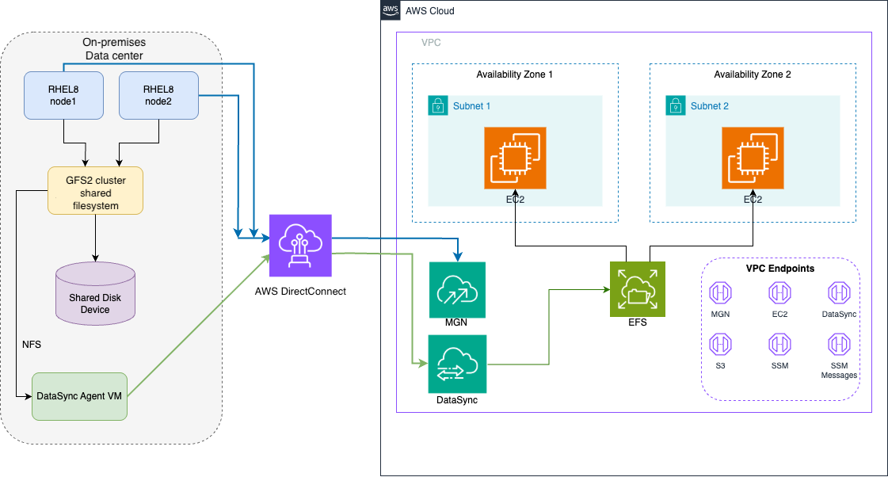

## Code repo

This repository contains four scripts that work together to migrate shared storage from an on-premises RHEL 8 GFS2 cluster to Amazon EFS.

See [Prerequisites](PREREQS.MD) for account, networking, IAM, and infrastructure requirements before deploying.

See [Cleanup](CLEANUP.MD) for ordered steps to destroy all resources created by this pattern.

### Architecture



### 1. efs-cloudformation.yaml

CloudFormation template that provisions the EFS infrastructure.

**Resources created:**

- Encrypted EFS filesystem (general purpose, bursting throughput) using a customer-managed KMS key
- EFS file system policy enforcing TLS in transit (denies plaintext NFS connections)
- Mount targets in two Availability Zones
- Security group allowing NFS (port 2049) from an application security group and itself (self-referencing rule for inter-mount-target communication)
- Two access points: `/app` and `/data`

**Parameters required:**

| Parameter | Description |
|-----------|-------------|
| VpcId | VPC to deploy into |
| SubnetAz1 / SubnetAz2 | Subnets for mount targets |
| AppSecurityGroupId | Security group allowed NFS access |
| KmsKeyArn | ARN of the customer-managed KMS key (CMK-EFS) for EFS encryption at rest |

**Stack outputs:** FileSystemId, AccessPointAppId, AccessPointDataId, EfsSecurityGroupId

### 2. datasync-task.yaml

CloudFormation template that creates a DataSync task to replicate data from an on-premises NFS server to EFS.

**Resources created:**

- CloudWatch Logs log group (90-day retention) for DataSync task execution logs
- NFS source location (using a DataSync agent)
- EFS destination location (with TLS 1.2 in-transit encryption)
- DataSync task (daily schedule, transfers only changed files, logs at TRANSFER level)

**Parameters required:**

| Parameter | Description |
|-----------|-------------|
| NFSServerIP | IP address of the NFS server |
| DataSyncAgentId | DataSync agent ID |
| NFSMountPath | Mount path on the NFS server |
| EFSAccessPointId | EFS access point ID |
| EFSFileSystemId | EFS file system ID |
| SubnetId | Subnet ID for EFS mount target |
| EFSSecurityGroupId | EFS security group ID |
| IAMRoleArn | IAM role ARN for DataSync to access EFS |
| KmsKeyArn | ARN of the customer-managed KMS key for encryption (EFS and CloudWatch Logs) |

### 3. disable-cluster-services.sh

Prepares existing RHEL 8 cluster nodes for the migration by disabling all cluster-related services on next boot. Must be run as root on each node of the 2-node cluster.

**What it does:**

- Disables Pacemaker, Corosync, pcsd, and DLM services
- Disables clustered LVM services (clvmd / lvmlockd) if present
- Comments out GFS2 entries in /etc/fstab (with a timestamped backup)
- Prints a verification summary of service states and fstab changes

### 4. efs-setup-ssm-document.json

Standalone SSM Command document that configures EC2 instances to mount the EFS filesystem. Targets instances tagged `EFS=required`.

**Steps:**

1. Installs AmazonEFSUtils via AWS Systems Manager Distributor (AWS-ConfigureAWSPackage)
2. Adds idempotent fstab entries for both access points with TLS enabled and mounts them:
   - `/app` → EFS access point for application data
   - `/data` → EFS access point for shared data

**Parameters required:**

| Parameter | Description |
|-----------|-------------|
| EfsFileSystem | EFS File System ID (from CloudFormation output). Validated against pattern `^fs-[0-9a-f]{8,40}$` |
| AccessPointApp | Access Point ID for /app. Validated against pattern `^fsap-[0-9a-f]{8,40}$` |
| AccessPointData | Access Point ID for /data. Validated against pattern `^fsap-[0-9a-f]{8,40}$` |

### Workflow

1. Deploy `efs-cloudformation.yaml` to create the EFS filesystem and access points
2. Deploy `datasync-task.yaml` (2 instances) to create 2 tasks for `/app` and `/data`. Use AWS MGN to migrate servers and AWS DataSync to replicate data from on-premises storage to EFS
3. Run `disable-cluster-services.sh` on each cluster node to disable GFS2 and cluster services
4. Perform MGN cutover to finalize server migration to AWS
5. Register `efs-setup-ssm-document.json` in SSM and run it against tagged instances:

```bash
aws ssm create-document \
  --name "EfsSetupDocument" \
  --document-type "Command" \
  --content file://efs-setup-ssm-document.json

aws ssm send-command \
  --document-name "EfsSetupDocument" \
  --targets "Key=tag:EFS,Values=required" \
  --parameters '{"EfsFileSystem":["fs-xxxx"],"AccessPointApp":["fsap-xxxx"],"AccessPointData":["fsap-yyyy"]}'
```

## Cost considerations

- The template creates the EFS filesystem in Regional, General Purpose, Bursting mode by default. Based on application assessment workshops and IOPS requirements, adjust the CloudFormation parameters for the appropriate EFS performance type before creating the filesystem.
- EFS Intelligent-Tiering lifecycle policy can reduce storage costs by moving content to other storage tiers. Review application data access patterns and performance requirements before setting up lifecycle policies.
- Monitor the Amazon CloudWatch dashboard for EFS `BurstCreditBalance` and `PercentIOLimit` metrics during data copy and after cutover to detect throughput bottlenecks early.
- Use the same EC2 instance type for the two nodes post cutover.
- AWS Backup is enabled for the EFS filesystem at creation time.

## Security considerations

- Limit EFS access to specific EC2 instances which require access to shared mount points. This can be achieved through security groups, IAM policies (role-based, EFS resource-based).
- Restrict the NFS export (`/etc/exports`) to only the AWS DataSync agent IP address. Do not use broad CIDR ranges.
- An Amazon EFS resource-based policy is applied to deny unencrypted connections (`aws:SecureTransport: false`).
- Utilize the test launch instance to validate the behavior of Amazon EFS before cutover, in particular hard links, permissions, and UID/GID.
- Review AWS CloudTrail logs for Amazon EFS, AWS DataSync, and AWS MGN API calls if you encounter any IAM authorization errors.
- Use a customer managed KMS key for EFS encryption at rest.
- Edit the DataSync tasks and change the Schedule to “Not Scheduled” after the final sync is completed from on-premises to EFS. 
- Consider a tightly scoped IAM Role for DataSync task execution (sample datasync-policy is provided in the code repository).
- Consider a tightly scoped KMS Key policy for the customer managed key (sample cmk-policy.json provided in repo).
- PosixUser is not enforced on the EFS access points as it could potentially break migrated application functionality and file permissions. If PosixUser is required, it must be enabled during the creation of access point.

## Contributing

See [CONTRIBUTING](CONTRIBUTING.md) for guidelines on how to contribute to this project.

## Code of Conduct

This project has adopted the [Amazon Open Source Code of Conduct](CODE_OF_CONDUCT.md).

## License

This project is licensed under the MIT-0 License. See the [LICENSE](LICENSE) file for details.
